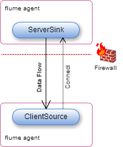
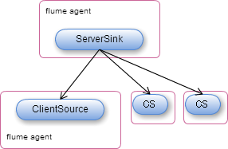

# Flume Receiver Intent-Based Sender Push Feature

## 概要

`flume-risp` は **Receiver Intent-based Sender Push メッセージ配信モデル**の Apache Flume Source/Sink 実装です。
従来のクライアント/サーバ型設計と同様に、データ受信側 (ClientSource) が必要に応じて送信側 (ServerSink) と接続し
アドホックなデータ収集を行います。これによりデータセンターの外部にデータフローを接続することができ、また受信側が
常に駆動している状態でなくても、必要なときにだけデータを収集する運用を行うことができます。

## 機能

`flume-rips` はデータセンター内からファイアウォールやロードバランサを介して外部にデータを送信できるよう Flume イベントを
WebSockets上で転送します。

`ClientSource` はデータが必要になったときに `ServerSink` へ接続します。`ServerSink` は複数の `ClientSource` インスタンス
に対してデータを送信することができます。

`ClientSource` が接続していないときのデータは保証されません。

### WebSockets Event Delivery

Sink は WebSocket サーバとして実装されており、Flume データ転送を要求するクライアントから接続することによってクライアント
(別の Flume Agent) に対してのデータ転送を開始します。

WebSockets 実装の選定について: Finagle は WebSockets 実装がない。Netty はバージョン 4 で WebSockets ハンドシェイクを
実装しているが Flume 1.6 は Netty 3.5 に依存している。Grizzly、Jetty は WebSockets クライアント/サーバ共に実装あり。

## メモ

* TODO: TLS (wss) 対応する。
* TODO: `ClientSink` 接続時にセッション確定、瞬断が発生してもセッションごとに一定イベント数または一定時間キューに保存しておく。
* 検討: キューを使って瞬断からの一定時間内の再接続でのデータを保証するか。
